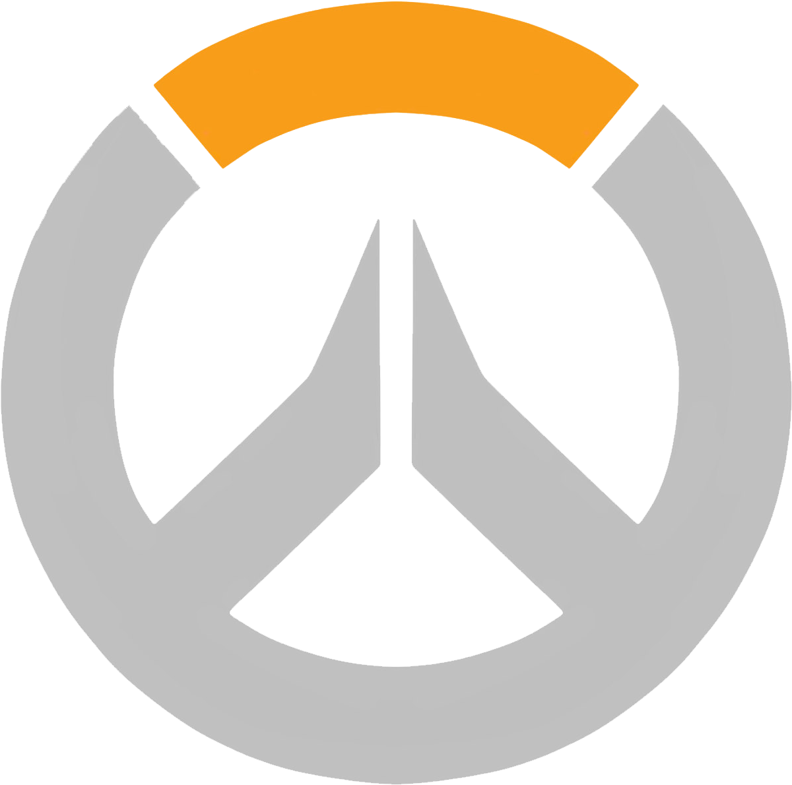
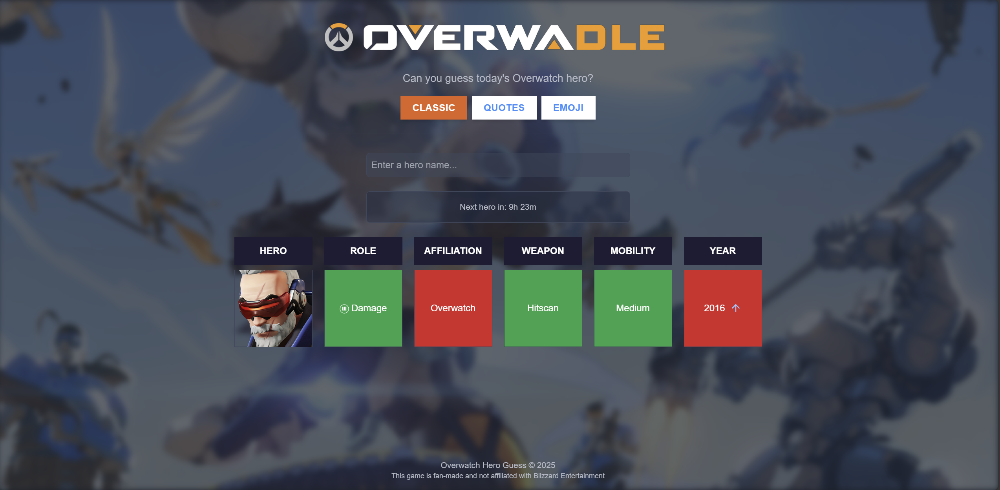
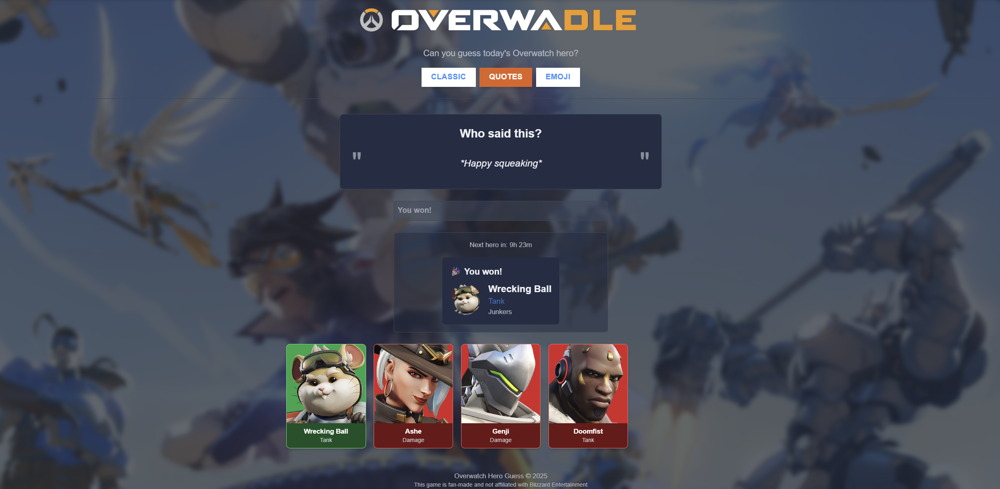
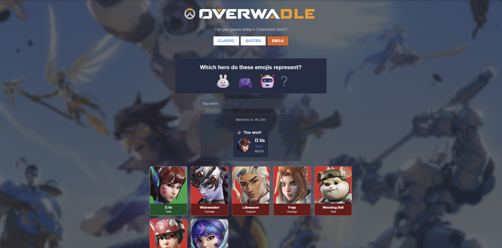

# Overwadle

<div align="center">
  
  <h3>The Overwatch Guessing Game</h3>
  <p>A daily Overwatch hero guessing game, inspired by Loldle</p>
  <p><a href="https://overwadle.online" target="_blank">Play Overwadle Now!</a></p>
</div>

## Overview

Overwadle is a fan-made daily guessing game for Overwatch fans where you try to identify the secret hero. With three distinct game modes, each offering a different way to test your Overwatch knowledge, Overwadle brings a fresh challenge every day.

**Play now at [https://overwadle.online](https://overwadle.online)**

## Previews

<div align="center">
  
  
  
</div>

## Game Modes

### Classic Mode
Guess the hero based on their attributes. After each guess, you'll see which attributes match the secret hero.

### Quotes Mode
Identify the hero from one of their in-game voice lines. How well do you know your favorite heroes' catchphrases?

### Emoji Mode
Can you recognize a hero from a series of emojis that represent them? Test your emoji interpretation skills!

## Technologies

- **React** - Frontend UI library
- **TypeScript** - Type-safe JavaScript
- **Vite** - Fast build tool and development server
- **React Router** - Navigation
- **GSAP** - Animations
- **Tailwind CSS** - Utility-first CSS framework
- **Radix UI** - Accessible UI componentss
- **Crypto-js** - Secure storage for game state

## Features

- Daily rotating heroes
- Three unique game modes
- Clean, Overwatch-themed UI
- Game progress saved locally
- Daily reset timer
- Encry

## Getting Started

```bash
# Clone the repository
git clone https://github.com/ben4ali/Overwadle

# Navigate to the project
cd overwadle

# Install dependencies
npm install

# Run the development server
npm run dev
```

## Inspiration

Overwadle is inspired by [Loldle](https://loldle.net/), a similar guessing game for League of Legends. This project adapts that concept to the Overwatch universe, bringing daily guessing challenges to Overwatch fans.

## Ready to Play?

Visit **[https://overwadle.online](https://overwadle.online)** to start playing now! A new hero challenge awaits you every day.

---

Created for fun by [Ali Benkarrouch](https://github.com/ben4ali)

> **Note:** This game is fan-made and not affiliated with Blizzard Entertainment.
> ** Made for educational purposes **
